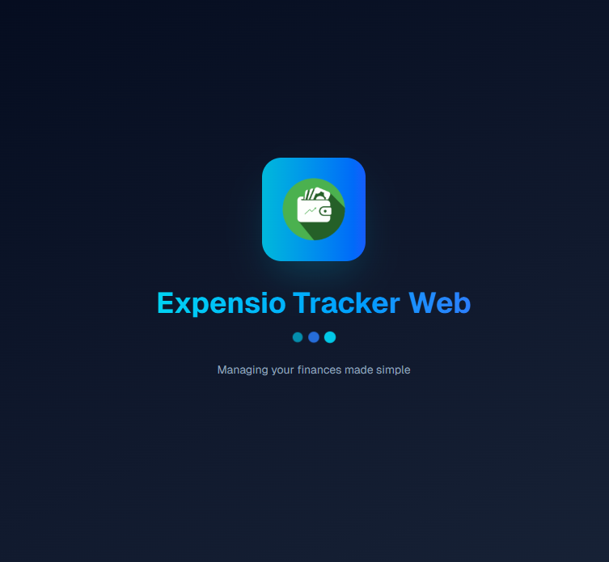
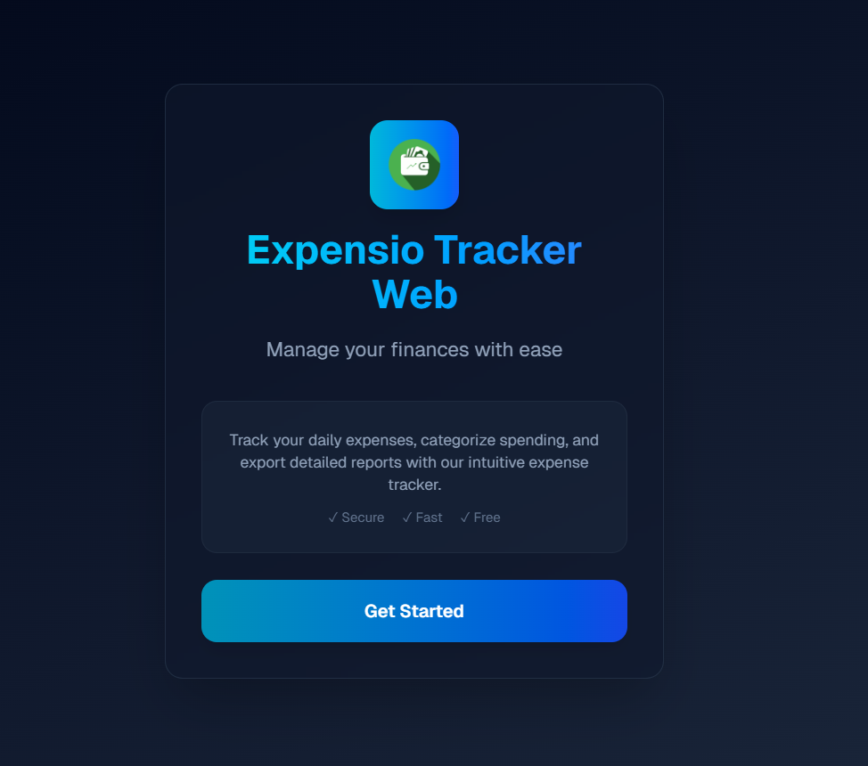
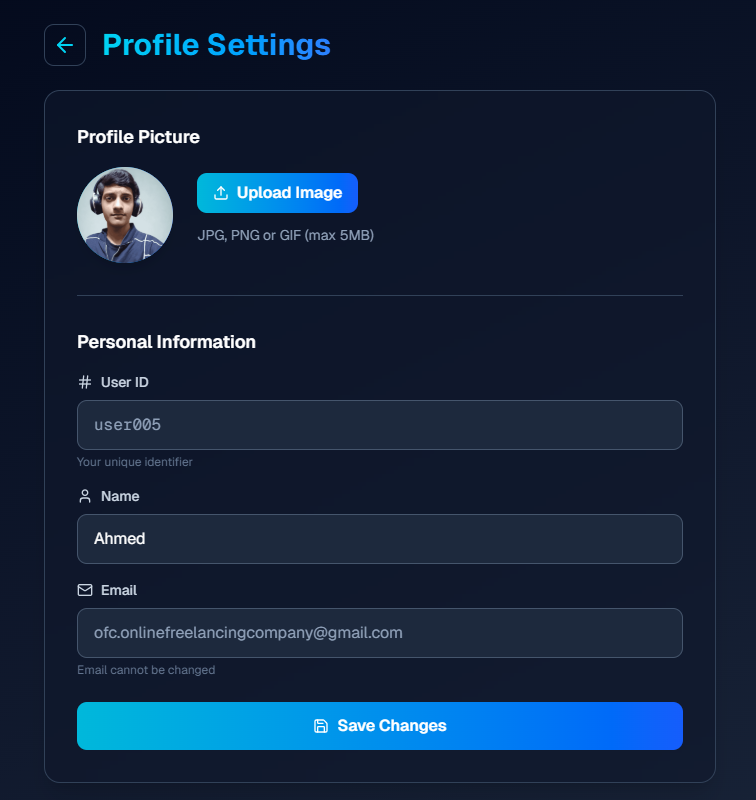
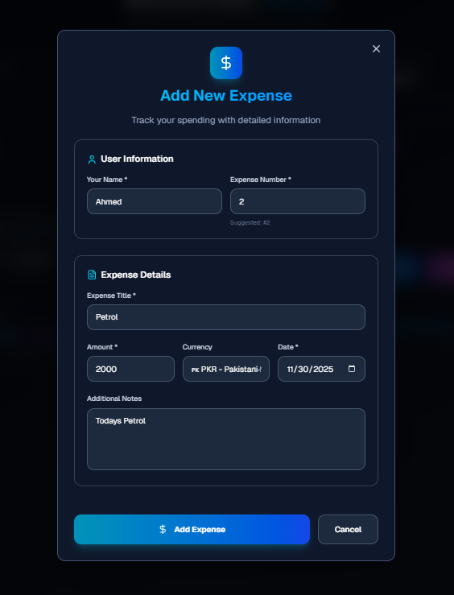
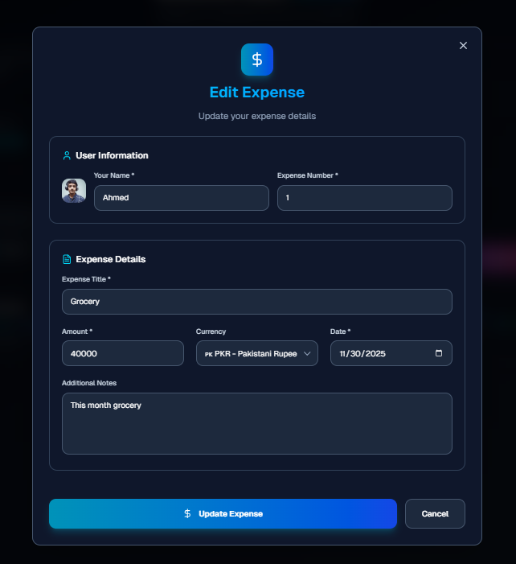
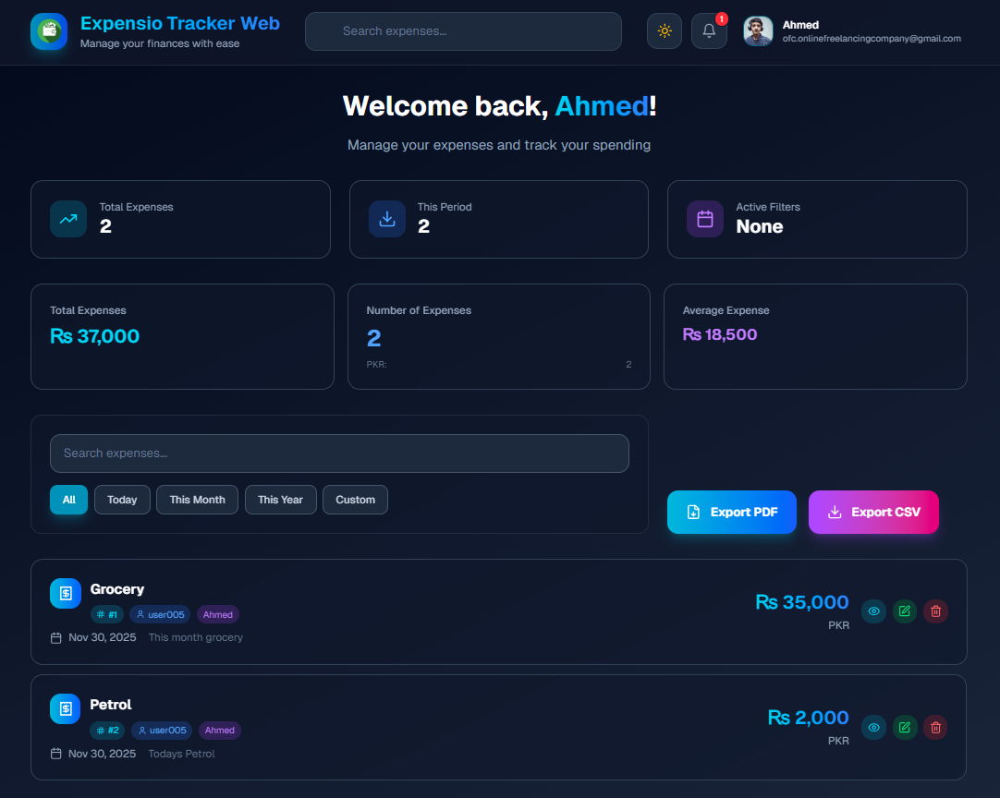
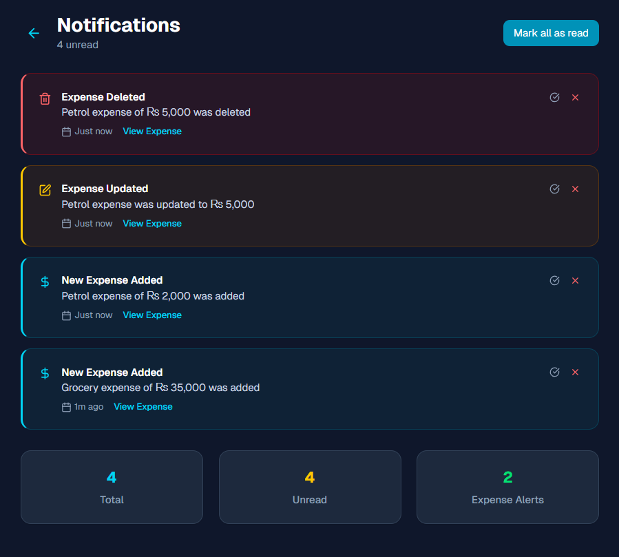
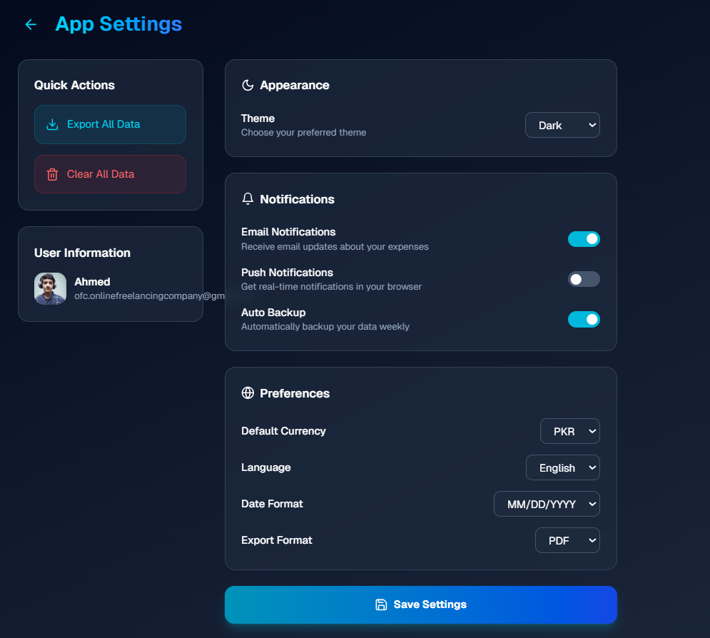

# Expensio Tracker Web 💰

A modern, full-stack expense tracking application built with cutting-edge web technologies. Manage your personal finances with ease, track expenses in multiple currencies, and generate detailed PDF reports.


🌐 **Website:** [https://expensio-tracker-web.vercel.app](https://expensio-tracker-web.vercel.app)

## 📸 Project Screenshots

<p align="center">
   &nbsp;
   &nbsp;
  
</p>

<p align="center">
   &nbsp;
   &nbsp;
  
</p>

<p align="center">
   &nbsp;
   &nbsp;
  
</p>

<p align="center">
   &nbsp;
  
</p>


## 🚀 Features

### ✨ Core Functionality
- **📊 Expense Management** - Add, edit, and delete expenses with detailed information
- **💰 Multi-Currency Support** - Track expenses in PKR, USD, EUR, GBP, and more
- **🔢 Sequential Numbering** - Automatic expense numbering with manual override
- **📱 Responsive Design** - Works perfectly on desktop, tablet, and mobile

### 🎨 User Experience
- **✨ Modern UI/UX** - Beautiful glass morphism design with smooth animations
- **🌙 Dark/Light Mode** - Toggle between themes for comfortable viewing
- **⚡ Real-time Updates** - Instant feedback with Framer Motion animations
- **🔔 Smart Notifications** - Get notified about new expenses with persistent storage

### 📊 Advanced Features
- **📈 Expense Analytics** - Visual summaries with animated counters
- **📅 Date Filtering** - Filter expenses by today, month, year, or custom range
- **🔍 Search & Filter** - Find expenses quickly with powerful search
- **📤 Export Capabilities** - Generate PDF reports and CSV exports

### 🔐 Security & Authentication
- **🔒 Google OAuth** - Secure authentication with Google Sign-In
- **👤 User Profiles** - Personalized experience with profile management
- **🛡️ Data Protection** - Secure data handling with JWT tokens

## 🛠️ Tech Stack

### Frontend
- **Next.js 15** - React framework with App Router
- **TypeScript** - Type-safe development
- **Tailwind CSS** - Utility-first CSS framework
- **Framer Motion** - Smooth animations and transitions
- **Lucide React** - Beautiful icons

### Backend
- **Next.js API Routes** - Full-stack capabilities
- **MongoDB** - NoSQL database for flexible data storage
- **JWT** - Secure authentication tokens
- **Cloudinary** - Image upload and management

### Authentication
- **Google OAuth** - Social authentication
- **HTTP-only Cookies** - Secure token storage
- **NextAuth.js** - Authentication library

## 👨‍💻 Author

**Muhammad Ahmed**  
Full Stack Web Developer  

I build high-performance web applications with a strong focus on modern UI/UX, smooth animations, and scalable architectures.  
Experienced in frontend-heavy products using Next.js, TypeScript, and animation-driven interfaces, while also capable of handling full-stack solutions when required.


## 📦 Installation

### Prerequisites
- Node.js 18+ 
- MongoDB database
- Google OAuth credentials
- Cloudinary account (for image uploads)

### Setup Instructions

1. **Clone the repository**
   ```bash
   git clone https://github.com/Muhammad-Ahmed-Developerr/Expensio-Tracker-Web.git
   cd Expensio-Tracker-Web
